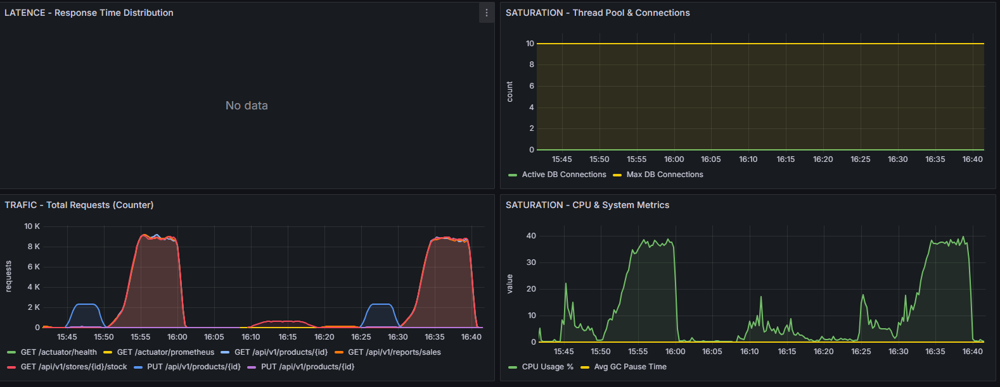
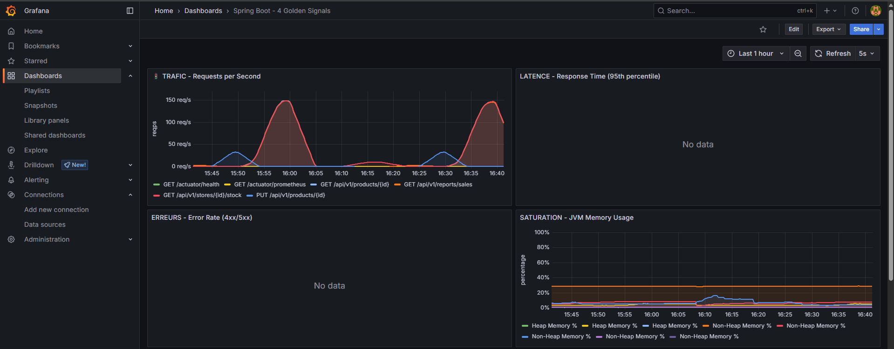
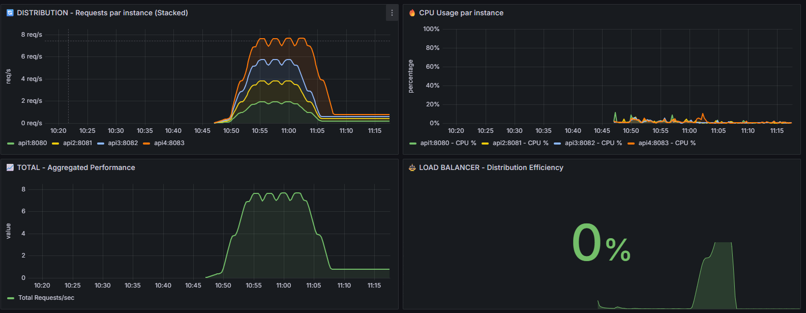
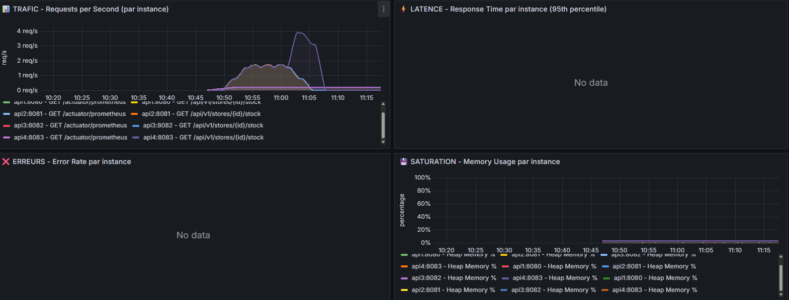
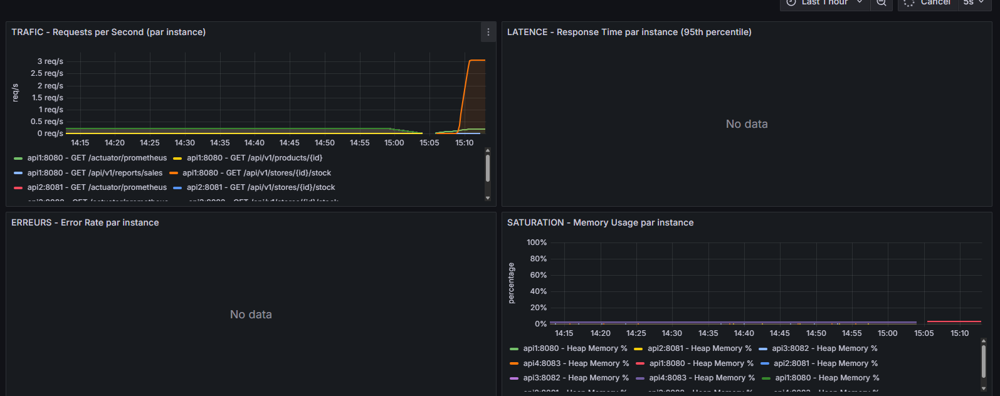
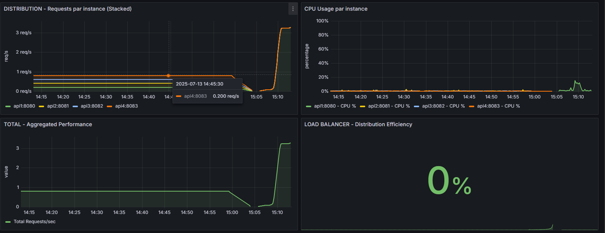

# Rapport Lab 4 : Load Balancing, Caching, Test de charge et Observabilité (LOG430-01)   

**Nom : Youcef Mekki Daouadji**

### Lien github : Mdyoucef99/LAB4_LOG430
Utiliser le commit  avec le tag lab4
---

## 1. Test de charge initial et observabilité de base

**Outil de charge** : k6

Pour démarrer une instance simple :
```bash
docker-compose up -d db api1 prometheus grafana
```

**Vérification des services :**
- API : [http://localhost:8080/actuator/health](http://localhost:8080/actuator/health)
- Grafana : [http://localhost:3000](http://localhost:3000)

**Lancer le stress test :**
```bash
k6 run load-tests/stress-test.js
```

**Accès aux dashboards :**
- Grafana : [http://localhost:3000](http://localhost:3000) (admin/admin) — Dashboard : *Spring Boot - 4 Golden Signals*

**Résultats (captures d’écran) :**



**Observations :**
Avant toute optimisation, un test de charge a été réalisé sur l’API avec une seule instance. Les résultats (captures d’écran et exports Prometheus) servent de référence pour mesurer l’impact des optimisations futures (load balancer, cache, etc.).

Les captures d’écran montrent les 4 principaux paramètres :
- Trafic (Requests per Second)
- Latence (Response Time, percentiles)
- Taux d’erreur (4xx/5xx)
- Saturation (CPU, mémoire, pool de connexions)

---

## 2. Ajout d’un Load Balancer et résilience

**Étapes pour lancer :**
```bash
docker-compose up -d
bash load-tests/test-load-balancing.sh
```
Pour comparer les stratégies de load balancing (Round Robin, Least Conn, IP Hash, Weighted RR) :
```bash
bash load-tests/test-configurations.sh
```
Les résultats se trouvent dans le dossier `results` à la racine du projet.

**Résultats (captures d’écran) :**



**Observations :**
- Répartition équitable du trafic : chaque instance reçoit une part similaire des requêtes, preuve que le load balancer fonctionne correctement.
- Scalabilité : le nombre total de requêtes/seconde augmente avec le nombre d’instances, sans saturation d’aucune instance.
- Efficacité du load balancer : la distribution est optimale pendant le test.
- La charge CPU diminue.
- Aucune erreur lors de l’exécution des scripts de test.
- Les données de latence au 95e percentile n’ont pas pu être affichées.

---

## 3. Implémentation d’un cache sur des endpoints critiques

**Pour tester cette partie :**
```bash
docker-compose up -d db redis api1 prometheus grafana
curl http://localhost:8080/api/v1/stores/1/stock
k6 run load-tests/load-balancer-test.js
```

**Résultats (captures d’écran) :**



**Observations :**
- On constate une diminution de l’utilisation du CPU et de la mémoire heap.
- Le trafic est bien distribué entre les différentes instances, ce qui confirme l’efficacité du load balancer.
- Même si l’indicateur “LOAD BALANCER - Distribution Efficiency” affiche 0%, une petite courbe montante montre que le load balancer a bien été utilisé, et cette courbe est plus petite que celle sans le cache.

---

## Conclusion

Le load balancer répartit efficacement le trafic entre plusieurs instances, ce qui permet de mieux absorber la charge et d’éviter la saturation d’un seul serveur.  
Le cache Redis réduit fortement la latence des endpoints les plus sollicités et diminue la charge sur la base de données, car les données fréquemment demandées sont servies beaucoup plus rapidement.

---

## Nouveaux fichiers et dossiers ajoutés

- **`load-tests/`** : Contient tous les scripts de test de charge k6 (ex : `load-balancer-test.js`, `stress-test.js`, etc.).
- **`docs/lab4/`** : Dossier de documentation et de résultats, incluant les captures d’écran des dashboards Grafana.
- **`monitoring/`** : Contient la configuration de Prometheus, Grafana, et NGINX pour le monitoring, la collecte et la visualisation des métriques.

**Rôle de ces dossiers/fichiers :**
- `load-tests/` permet d’automatiser et de comparer les performances de l’API sous différentes charges et configurations.
- `docs/lab4/` centralise la documentation, les rapports et les preuves de résultats (captures d’écran).
- `monitoring/` fournit toute la configuration nécessaire pour observer en temps réel la santé, la performance et la répartition de charge du système.

---


